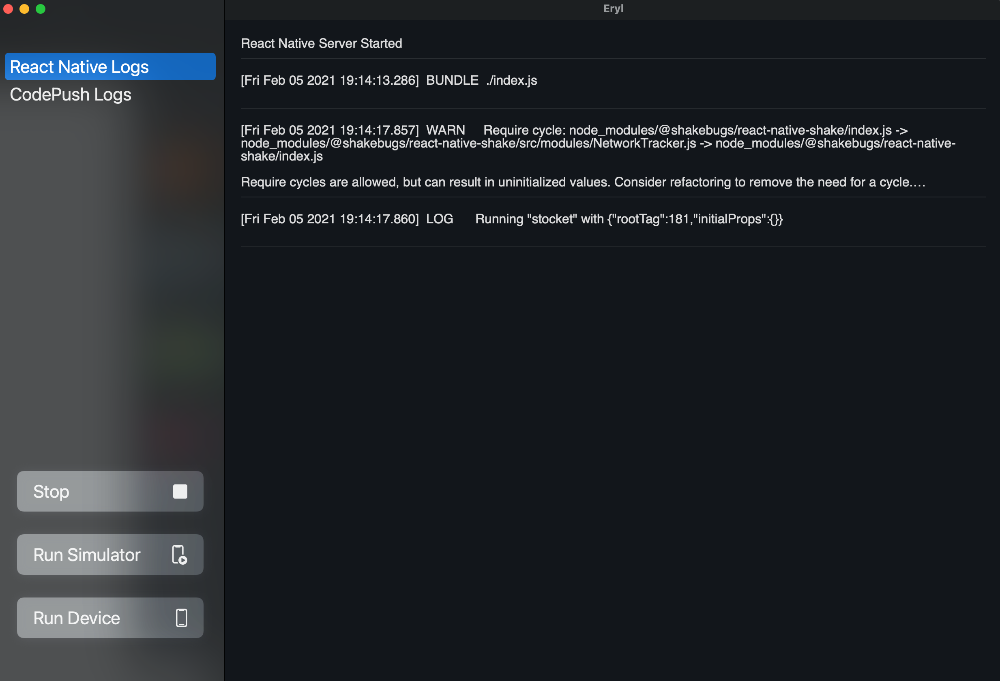

# Eryl

I created Eryl to speed up development when working on my React Native Projects. Start the react native server, run on simulator or device, and send codepush updates (coming soon).



## What you need

There are a few things you should do before you proceed.

### 1. Add the following to your scripts in your `package.json` inside your React Native project

```json
{
	"scripts": {
		"ios": "npx react-native run-ios --simulator",
		"ios-device": "npx react-native run-ios --device \"[NAME OF YOUR iOS DEVICE]\""
	}
}
```

### 2. Open this project in Xcode and edit `ReactNativeAppTools.swift`

Edit the `projectPath` variable on line 18 with the path to your React Native project root directory.

```swift
private var projectPath = "path/to/your/project"

```

### 3. Run

### Optional

You can also archive the project and run it on release mode. All you have to do (after completing the steps above) is:

```
Product -> Archive -> Distribute App -> Copy App -> Export
```
